# Waybar Config — Clean Waybar setup

## Main Highlight

**Todo and countdown module**

- [todo-lists](https://github.com/Harsh-bin/waybar-todo-lists)


- [waybar-countdown](https://github.com/Harsh-bin/waybar-countdown)
  
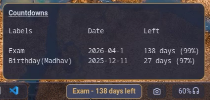

---

### Keyboard state

- caps unlock
  
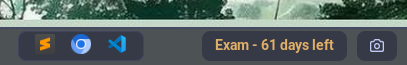

- caps lock
  
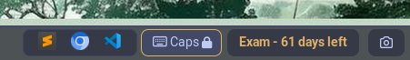

---

## Preview

- waybar themes with matching rofi theme

https://github.com/user-attachments/assets/b7c7d347-d024-439b-ac7b-c85e83ae1aaa


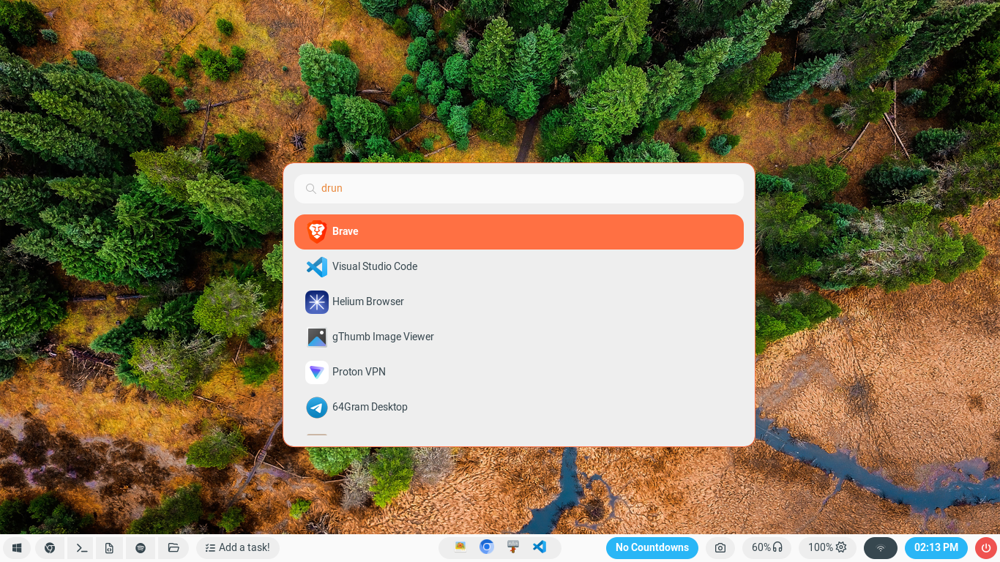

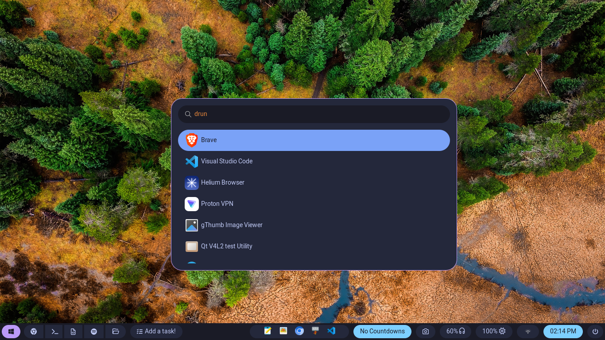

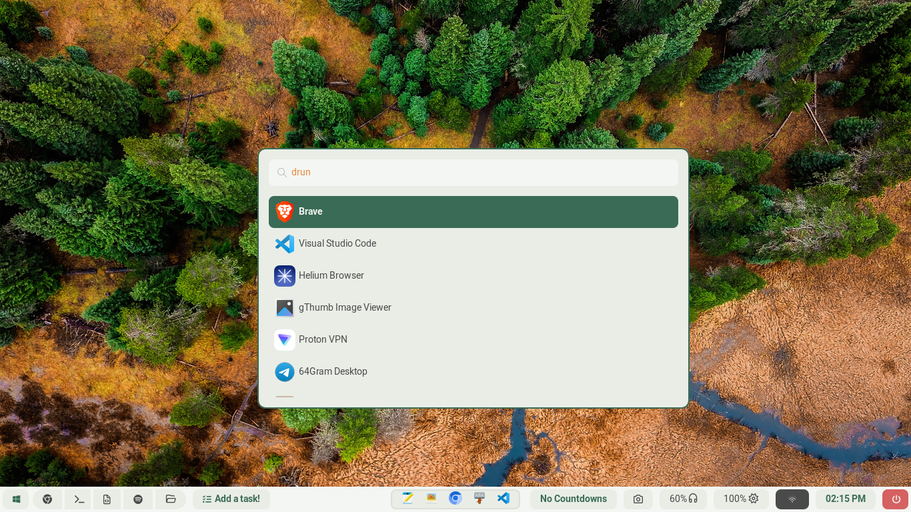

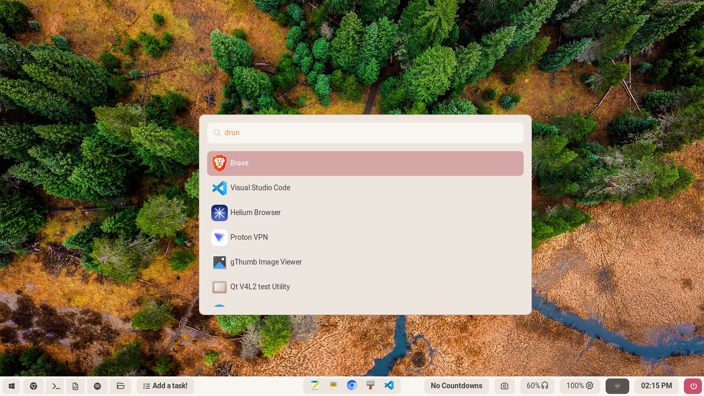

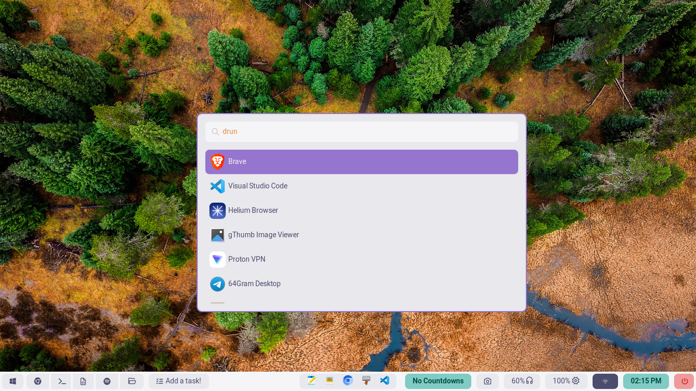

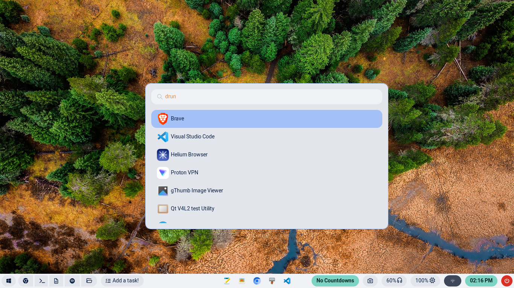

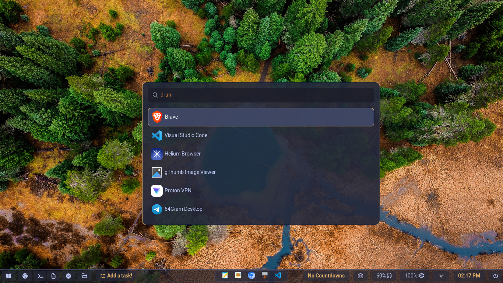

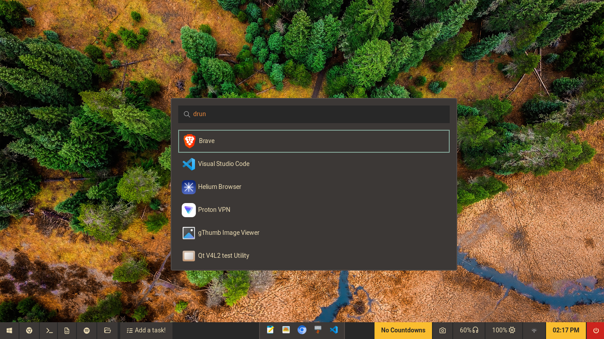

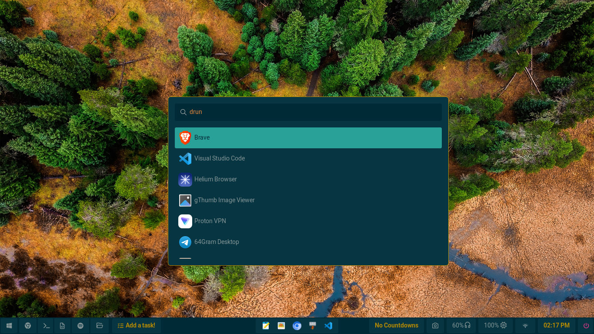

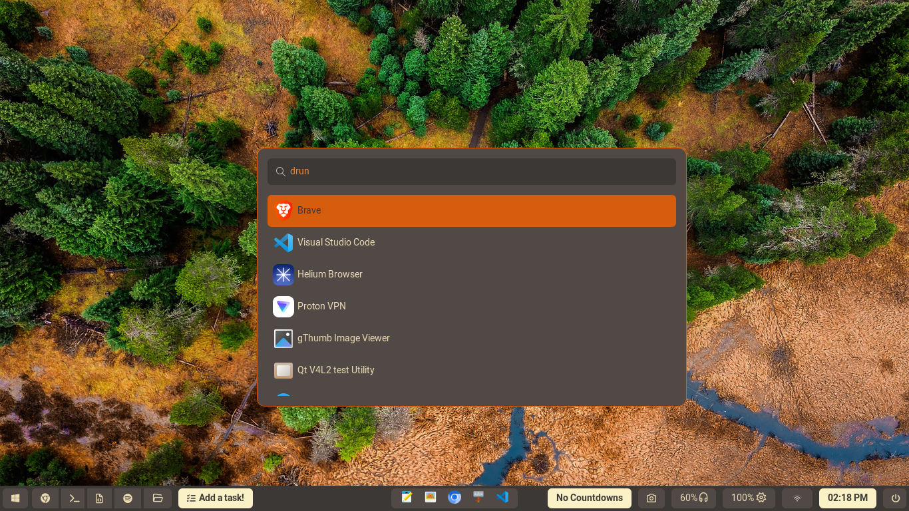

---

## Install 
```
git clone https://github.com/Harsh-bin/waybar-config.git
cd waybar-config
chmod +x ./install.sh
./install.sh
```

This is important: configuration relies on the `Foot terminal`,

```
      "custom/countdown":
      {
          "exec": "~/.config/waybar/scripts/countdown/countdown.sh",
          "return-type": "json",
          "format": "{}",
          "interval": 3600,
          "on-click-right": "foot bash ~/.config/waybar/scripts/countdown/countdown.sh interactive", # change this to your preferred terminal
          "on-scroll-up": "~/.config/waybar/scripts/countdown/countdown.sh scroll-up",
          "on-scroll-down": "~/.config/waybar/scripts/countdown/countdown.sh scroll-down"
      },
```
and also the `todo.sh` script used by the `custom/todo` module.
you must either install it or update configuration and a single line in `todo.sh` to use a different terminal emulator.

## Tweaking the `config.json` to your need

**Example: Change the browser used by the `custom/chrome` module**

- **Open** the file `config.jsonc` and edit `custom/chrome`

```
"custom/chrome":
{
	"format": "",
	"tooltip": true,
	"tooltip-format": "Browser",
	"on-click": "google-chrome-stable",
	"on-click-right": "chromium",
	"on-click-middle": "brave"
}
```

- **Edit** the `on-click`, `on-click-right`, or `on-click-middle` commands to your preferred browsers. For example, to make left-click open `firefox`, right-click open `brave`, and middle-click `google-chrome` change it to:

```
"custom/chrome":
{
	"format": "",
	"tooltip": true,
	"tooltip-format": "Browser",
	"on-click": "firefox",
	"on-click-right": "brave",
	"on-click-middle": "google-chrome-stable"
}
```

Apply the same edit pattern to other `custom/*` modules.


## Included scripts overview

- `lock.sh` — lock screen helper requires [swaylock-effects](https://github.com/mortie/swaylock-effects)
- `power.sh` — uses zenity to show menu (shutdown, reboot, logout) `logout cmd is configured for labwc modify this according to your DE`
- `theme.sh` — cycle through the waybar themes on right clicking the menu module
- `countdown.sh` — used by the `custom/countdown` module
- `todo.sh` and `todo_tui.sh` — used by the `custom/todo` module

